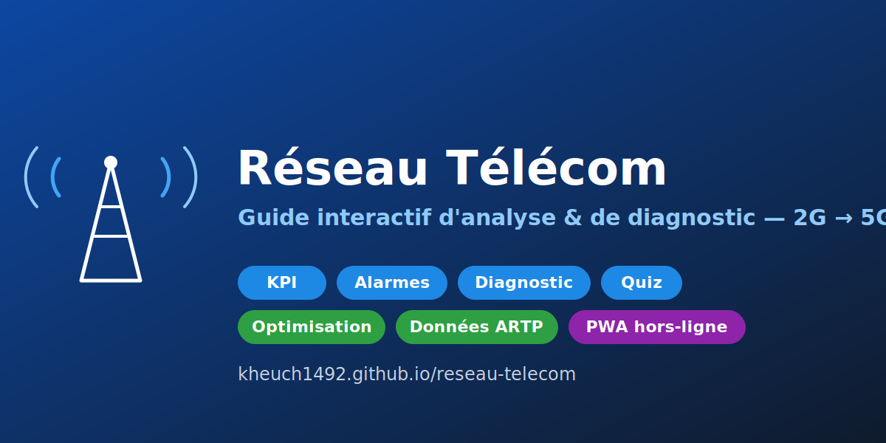

# 📡 Réseau Télécom — Guide d'analyse & diagnostic



[](https://kheuch1492.github.io/reseau-telecom/)


### 🌐 Site en ligne : **https://kheuch1492.github.io/reseau-telecom/**

Site de référence interactif pour l'**analyse et le diagnostic de réseau télécom** : métier d'analyste réseau, outils OSS (NetAct / U2020), commandes MML, alarmes, processus de résolution d'incident, KPI, optimisation radio, cas pratiques, quiz de révision et préparation à l'entretien.

> Outil personnel de travail et de révision (transition profil BI → analyse de réseau radio / performance télécom).

## 🖼️ Aperçu

> 💡 Pour une capture d'écran réelle : ouvre le site, fais une capture, enregistre-la sous `docs/screenshot.png` puis remplace `cover.svg` ci-dessus par `docs/screenshot.png`.

## ✨ Contenu

- 👷 **Le métier** d'analyste réseau / ingénieur performance radio
- 🏗️ **Architecture réseau** (RAN, Transmission, Cœur) + anatomie d'un site
- 📶 **Générations & 5G** (2G→5G, NSA/SA, slicing…)
- 🛠️ **Outils OSS** : NetAct (Nokia) & U2020 (Huawei) + boîte à outils complète
- ⌨️ **Commandes MML** Huawei (copiables, filtrables, exemples détaillés)
- 🚨 **Alarmes** fréquentes (filtrables par sévérité) + correspondance Huawei ↔ Nokia
- 🔄 **Processus de résolution d'incident** (7 étapes interactives) + escalade + modèle de ticket
- 🌳 **Arbres de décision** interactifs (alarme → diagnostic → action)
- 📊 **KPI** avec formules et seuils cibles
- 🎚️ **Optimisation radio** (tilt, azimut, puissance, handover…)
- 📐 **Cas pratiques chiffrés** (incidents résolus avec KPI avant/après)
- 📋 **Routine & checklist** quotidienne
- 🧠 **Quiz de révision** type HCIA-5G (scoré)
- 🎤 **Préparation à l'entretien** (questions / réponses modèles)
- 📖 **Glossaire** des acronymes

## ▶️ Lancer en local

Aucune installation : le site est en HTML/CSS/JS pur.

```bash
# Option 1 — ouvrir directement
# double-cliquer sur index.html

# Option 2 — serveur local (recommandé)
python -m http.server 4321
# puis ouvrir http://localhost:4321
```

## 📁 Structure

| Fichier | Rôle |
|---|---|
| `index.html` | Structure et contenu des sections |
| `styles.css` | Design (responsive + thème sombre + impression) |
| `app.js` | Interactivité (navigation, recherche, quiz, arbres…) |
| `data.js` | Données (alarmes, KPI, glossaire, entretien…) |

## 🛠️ Stack

HTML5 · CSS3 · JavaScript vanilla (zéro dépendance, zéro build).
